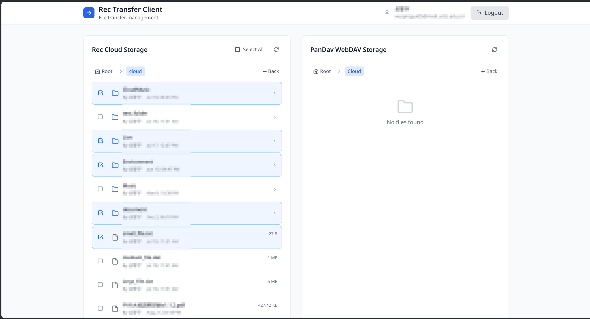

# 功能介绍

登录后您将看到以下页面：

其中，位于 Rec Cloud Storage 下的文件列表就是您的 Rec 云盘文件列表，位于 PanDav WebDAV Storage 下的文件列表就是您的科大新网盘文件列表。

可以看到，在 Rec Cloud Storage 下，有四个目录，它们的含义分别是：

- cloud: 个人云盘的根目录
- recycle: 个人云盘回收站的根目录
- backup: 个人云盘备份的根目录
- group: 群组云盘的根目录（进入后就是各个群组云盘的根目录）

其中，此次云盘迁移所需要涉及的目录只有 cloud 和 group，即个人云盘和群组云盘。

在 PanDav WebDAV Storage 下，您可以看到科大新网盘的资料库列表，根目录下的几个资料库都是个人和群组的资料库，群组资料库的名称通常以“群组资料库”结尾，如图中所示。

接着往下看，Transfer Control 块就是用来控制云盘迁移的过程的，其中 Max Concurrent Transfers 是用来设置迁移时的最大并发数（同时正在运行的迁移的文件数）的，默认值为 2，您可以根据自己的网络情况进行调整。

最下面的 Transfer Monitor 块就是列出正在传输的文件/文件夹列表，不过现在才刚登录所以还没有正在传输的任务。

## 个人云盘迁移

首先点击左边 Rec Cloud Storage 的 cloud 目录，进入个人云盘的根目录。在这里，您能看到您的个人云盘文件列表，通过勾选文件或文件夹的复选框，您可以选择要迁移的文件或文件夹。

然后，选择完毕后，点击 PanDav WebDAV Storage 下您想要迁移过去的科大新网盘资料库。

例如：

!!! note "查看迁移文件大小"

    在选择一些文件或文件夹后，您可以在下面的提示栏中看到你所选中的文件或文件夹的总大小，这样可以帮助您判断是否有足够的空间来存储这些文件。

接着，在 Transfer Control 块中，您可以看到要传输的文件列表，要传输过去的目标资源库，在确认无误后，点击 Start Transfer 按钮即可开始迁移。

最后您能在最下面的 Transfer Monitor 块中看到迁移的进度和状态。

您可以暂停，恢复或取消迁移任务。

## 群组云盘迁移

群组云盘的迁移与个人云盘类似，首先点击左边 Rec Cloud Storage 的 group 目录，进入群组云盘的根目录。在这里，您能看到您所在的群组云盘列表，选择你想要迁移的群组并点击，进入该群组的云盘根目录，您可以选择要迁移的文件或文件夹。

然后，选择 PanDav WebDAV Storage 下您想要迁移过去的科大新网盘资料库，群组资料库的名称通常以“群组资料库”结尾。

接着，和个人云盘迁移过程是一样的，在 Transfer Control 块中，您可以看到要传输的文件列表和目标资源库，在确认无误后，点击 Start Transfer 按钮即可开始迁移。

最后您能在最下面的 Transfer Monitor 块中看到迁移的进度和状态。

## 辅助功能

如果您的科大新网盘中已经存放了文件/文件夹，或者由于传输失误，有部分文件夹已经存在但是没完全传输过去，您可以在 PanDav WebDAV Storage 下看到这些文件/文件夹也能被选中。

选中一些文件/文件夹之后，您可以在 Transfer Control 块中看到一个按钮叫做 "Delete Selected"，点击它可以删除这些选中的文件/文件夹。这是一个辅助功能，主要是为了方便用户清理云盘迁移过程中意外传输失败的文件/文件夹，以便能够重新传输。

